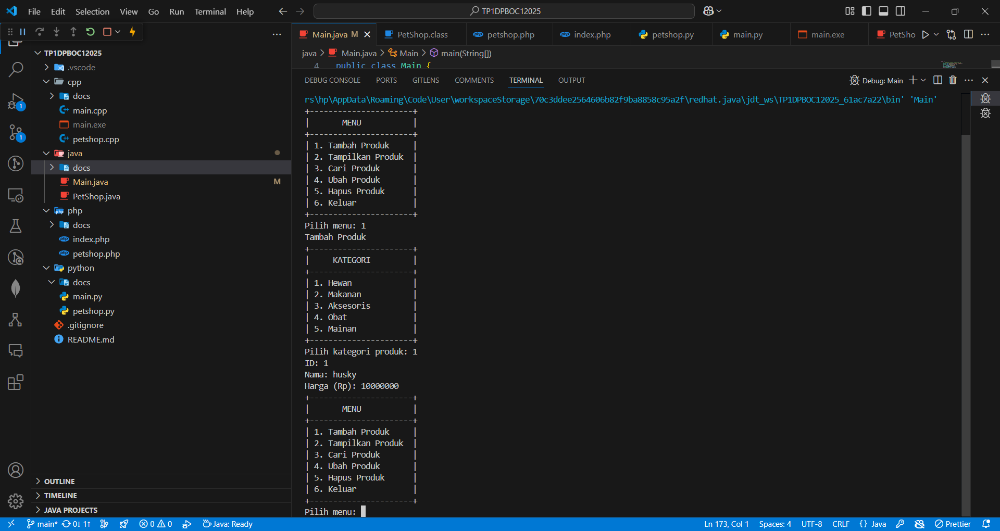

# Desain dan Pemrograman Berbasis Objek

## Tugas Praktikum 1

### Janji

Saya Fariz Wibisono dengan NIM 2307589 mengerjakan Tugas Praktikum 1 dalam mata kuliah Desain dan Pemrograman Berorientasi Objek untuk keberkahanNya maka saya tidak melakukan kecurangan seperti yang telah dispesifikasikan. Aamiin.

### Dokumentasi

#### Bahasa Pemrograman

Proyek ini diimplementasikan dalam beberapa bahasa pemrograman. Berikut adalah hasil run kode di setiap bahasa:

1.  **C++**
   

2.  **Java**
   

3.  **PHP**
   

4.  **Python**
   

#### Penjelasan Atribut dan Metode

Berikut adalah penjelasan rinci mengenai atribut dan metode yang dibuat dalam proyek ini:

1. **Atribut**

   - **id_produk**: Menyimpan identifikasi unik untuk setiap produk.
   - **nama_produk**: Menyimpan nama dari produk.
   - **kategori_produk**: Menyimpan kategori atau jenis dari produk.
   - **harga_produk**: Menyimpan harga dari produk.
   - **foto_produk**: Menyimpan foto atau gambar dari produk.

2. **Metode**

   - **Setter dan Getter**:

     - **setIdProduk(id_produk)**: Mengatur nilai `id_produk`.
     - **getIdProduk()**: Mengambil nilai `id_produk`.
     - **setNamaProduk(nama_produk)**: Mengatur nilai `nama_produk`.
     - **getNamaProduk()**: Mengambil nilai `nama_produk`.
     - **setKategoriProduk(kategori_produk)**: Mengatur nilai `kategori_produk`.
     - **getKategoriProduk()**: Mengambil nilai `kategori_produk`.
     - **setHargaProduk(harga_produk)**: Mengatur nilai `harga_produk`.
     - **getHargaProduk()**: Mengambil nilai `harga_produk`.
     - **setFotoProduk(foto_produk)**: Mengatur nilai `foto_produk`.
     - **getFotoProduk()**: Mengambil nilai `foto_produk`.

   - **Konstruktor dan Destruktor**:

     - **Konstruktor**: Metode yang dipanggil saat pembuatan objek untuk menginisialisasi atribut dengan nilai awal.
     - **Destruktor**: Metode yang dipanggil saat objek dihancurkan untuk melakukan pembersihan atau dealokasi sumber daya.

   - **Fungsi CRUD**:
     - **Create**: Fungsi untuk menambahkan data produk baru ke dalam sistem.
     - **Read**: Fungsi untuk membaca atau mengambil data produk dari sistem.
     - **Update**: Fungsi untuk memperbarui data produk yang sudah ada dalam sistem.
     - **Delete**: Fungsi untuk menghapus data produk dari sistem.

Penjelasan di atas mencakup fungsi dari masing-masing atribut serta metode yang dibuat dalam proyek ini. Pastikan untuk melihat gambar hasil run kode di setiap bahasa untuk memahami implementasi lebih lanjut.
